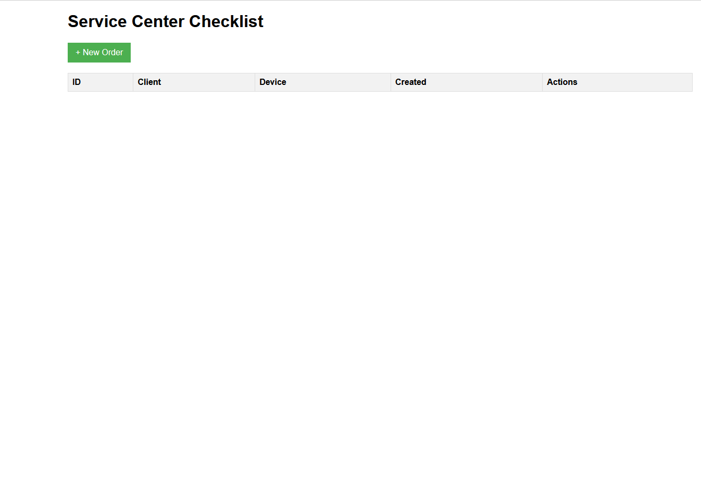
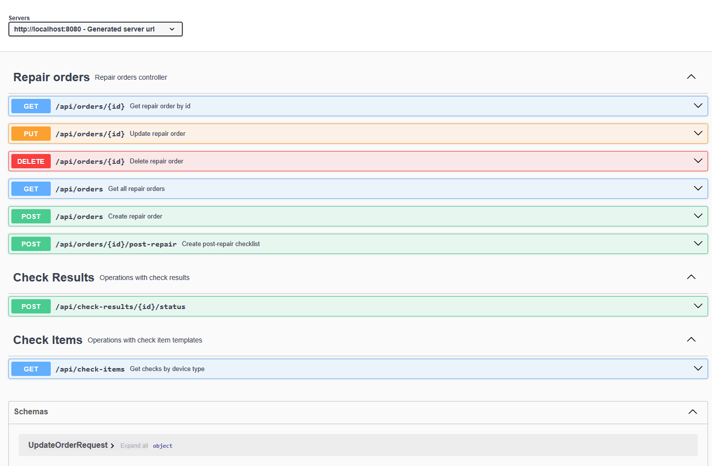
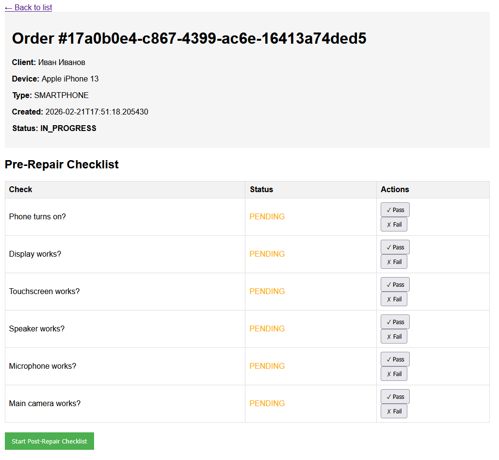

# Service Center Checklist System

Система для входного/выходного контроля техники в сервисном центре.

## Возможности
-  Создание заказов на ремонт
-  Автоматическая генерация PRE_REPAIR и POST_REPAIR чек-листов
-  Умные зависимости между проверками
-  Автоматическое NOT_APPLICABLE при блокирующих дефектах
-  Статусы заказов (IN_PROGRESS → COMPLETED)
-  REST API + Web UI (Thymeleaf)
-  Swagger документация
-  Кэширование в Redis
-  Docker-контейнеризация

## Технологии
- Java 17
- Spring Boot 4.0.2
- Spring Data JPA + Hibernate
- PostgreSQL + Liquibase
- Redis + Spring Cache
- MapStruct
- Lombok
- Thymeleaf
- Swagger/OpenAPI 3
- JUnit 5 + Mockito
- Docker + docker-compose

## Запуск проекта

### Локально

Изменить в application.properties данные бд на ваши (пароль/название)

```bash
# Собрать проект
./mvnw clean package
# Запустить
java -jar target/checklist-0.0.1-SNAPSHOT.jar
```
### Запуск через Docker

В файле docker-compose.yml заменить данные бд на ваши (пароль/название)

```bash
docker-compose up --build
```
## Доступные endpoints
- UI: http://localhost:8080/ui/
- Swagger: http://localhost:8080/swagger-ui/index.html
- API: http://localhost:8080/api/orders

## Примеры запросов
- GET /api/orders - все заказы
- POST /api/orders - создать заказ
- GET /api/check-items?deviceType=SMARTPHONE - проверки для смартфона

## API Endpoints
| Метод | URL | Описание |
|-------|-----|----------|
| `GET` | `/api/orders` | Все заказы |
| `GET` | `/api/orders/{id}` | Заказ по ID |
| `POST` | `/api/orders` | Создать заказ |
| `PUT` | `/api/orders/{id}` | Обновить заказ |
| `DELETE` | `/api/orders/{id}` | Удалить заказ |
| `POST` | `/api/orders/{id}/post-repair` | POST_REPAIR чек-лист |
| `GET` | `/api/check-items` | Проверки по типу |
| `PUT` | `/api/check-results/{id}/status` | Обновить статус |

## Тестирование
````bash
# Запустить все тесты
./mvnw test

# Запустить конкретный тест
./mvnw test -Dtest=CheckItemServiceTest
````

## Скриншоты

### Главная страница


### Swagger UI


### Пример чек-листа


## Планы по развитию
- Увеличить кол-во доступных проверок и связей между ними
- Дополнить и доработать проверки для ноутбуков
- Добавить проверки для других типов техники(системные блоки, консоли и т.п)
- Добавить Аутентификацию и Авторизацию